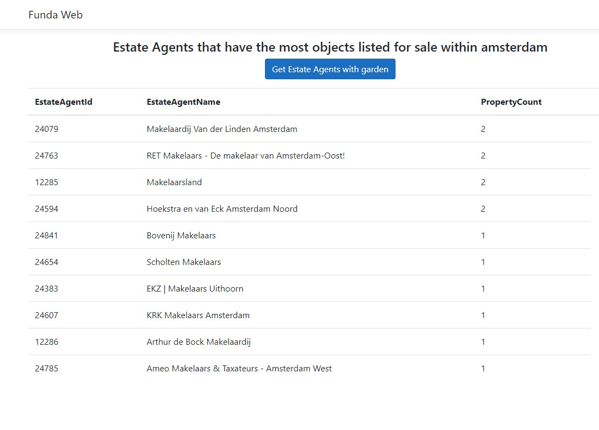

# Funda Estate Agent List

This application includes an ASP.NET web app, which is connected to the Funda REST-API. Fetches all objects for sale in Amsterdam with filter and groups them via estate agent. Then lists the top 10 real estate agents in descending order. After Clicking "Get estate agents with garden" button, does same thing to objects with garden.

## Technologies & Libraries & Frameworks

I used ASP.NET 5 MVC, Entity Framework Core, xUnit, Moq, Flurl while developing the project. 

## Extendable & Improvable Parts Of The Project

• Exception Middleware can be extendable for different kinds of exceptions. We can inform the client more clearly and define the business rules about the application.

• Logger Middleware has to be written for collecting information, warnings, errors, and so on. 

• Authentication-Authorization structure should be included in the project because of the security and accessibility issues.

• AutoMapper and Mediatr can be used If the project extends.

• We can use FluentValidator to check requests are valid or not regarding our business rules. We can manage specific validation flows as well.

• Unit test coverage should be increased writing for all of the work units of code.

• We can use the Azure Key vault to get secure data.

• I used Polly to handle and avoid too many request exceptions. We can define and add differen policies to provide Http policies
## MVC App:

